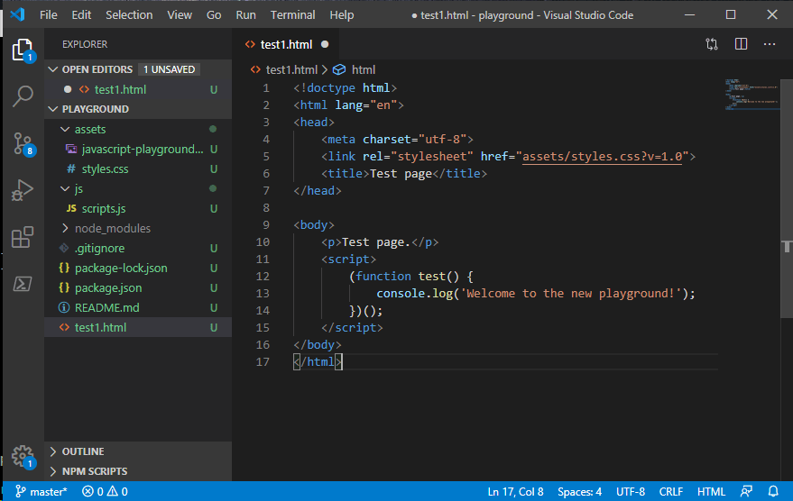
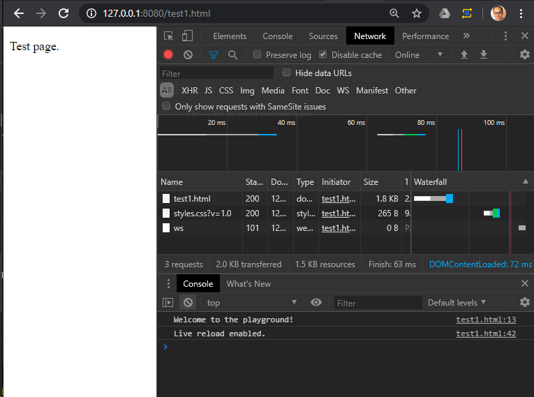

A simple HTML/CSS/JavaScript playground. Local playground alternative to [CodePen](https://codepen.io/), [JS Fiddle](https://jsfiddle.net/), etc.

Uses [live-server](https://www.npmjs.com/package/live-server) behind the scene.

# Quick Start

Clone the project & run npm stall:

```
git clone https://github.com/chinhdo/html-css-javascript-playground.git

npm install
```

Inside the project folder, start your server:

```
npm start
```

The browser should automatically open and show a directory listing. Click on test1.html to view it. Open the browser development tools/console window.

In a code editor such [Visual Studio Code](https://code.visualstudio.com/), make changes to the page's HTML or JavaScript code, save and observe the changes get loaded/executed automatically.



